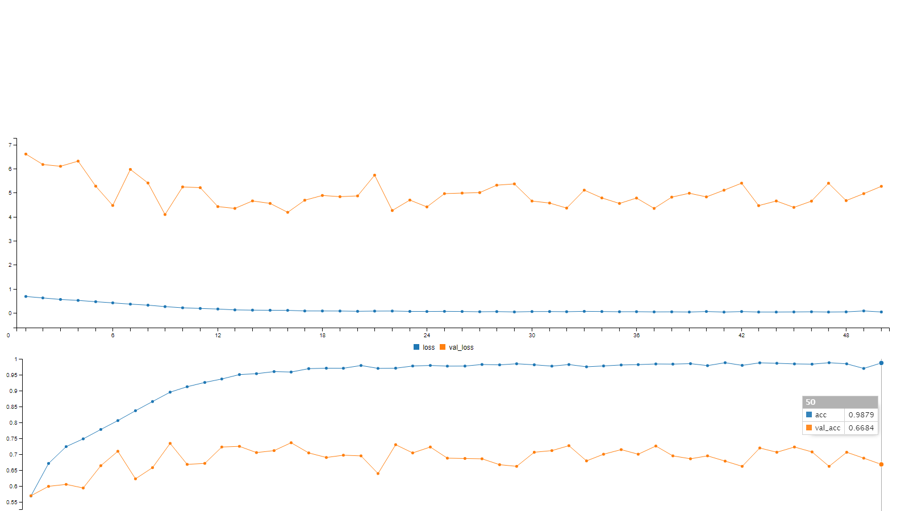
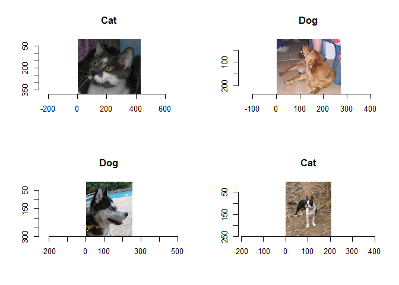
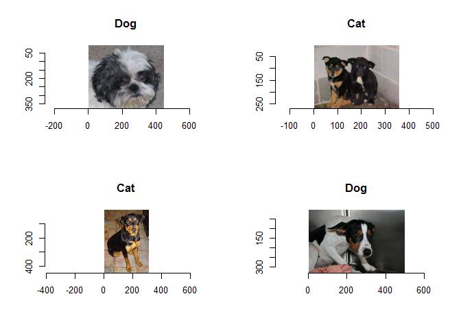
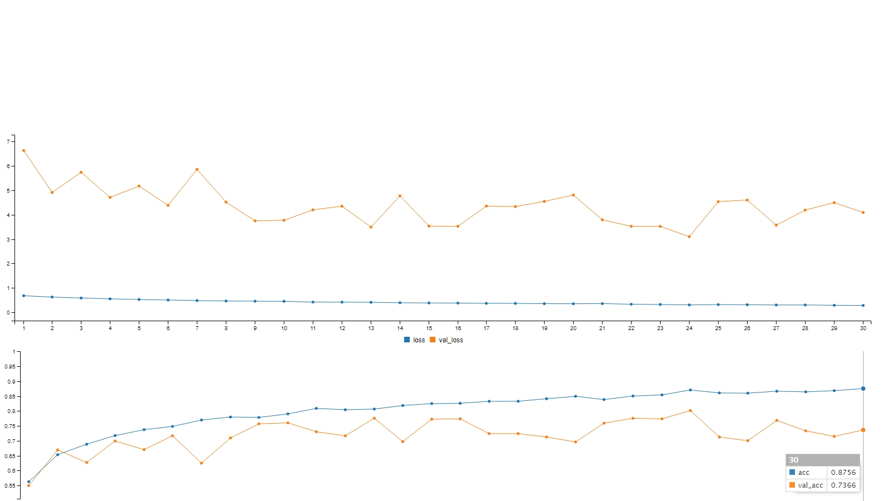
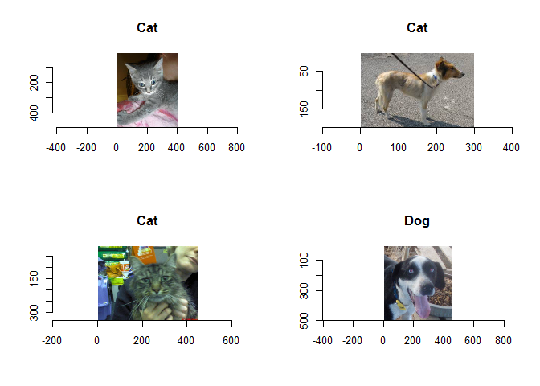
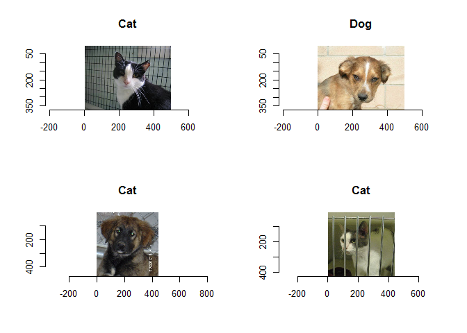

Image Recognition Using R
===========================

Loading required libraries and the dataset. 

``` r
library(imager)
```

    ## Loading required package: plyr

    ## Loading required package: magrittr

    ## 
    ## Attaching package: 'imager'

    ## The following object is masked from 'package:magrittr':
    ## 
    ##     add

    ## The following object is masked from 'package:plyr':
    ## 
    ##     liply

    ## The following objects are masked from 'package:stats':
    ## 
    ##     convolve, spectrum

    ## The following object is masked from 'package:graphics':
    ## 
    ##     frame

    ## The following object is masked from 'package:base':
    ## 
    ##     save.image

``` r
library(keras)
```

The train and test images are stored in seperate folders. <br>
 Since the machine I am using does not have a Nvidia GPU, I have decided to only include first 5000 images for train set and 1500 for test set. <br>
 Out of all the train images,1000 images have been saved seperately for the validation set.

``` r
train_files <- "C:/Users/Nihit/Documents/Dataset - Cats and Dogs/train"
test_files <- "C:/Users/Nihit/Documents/Dataset - Cats and Dogs/test"
val_files <- "C:/Users/Nihit/Documents/Dataset - Cats and Dogs/validation"
```

``` r
train_samples = 5000
validation_samples = 1000
test_samples = 1500
```

Data Preparation
================

Lets create image generators to take images from the system instead of loading all at once in R. <br> We will initially only rescale our data between scale of 0 and 1 which will help gradient descent to converge faster.

``` r
train <- image_data_generator(rescale = 1.0/255) 
validation <- image_data_generator(rescale = 1.0/255)
test <- image_data_generator(rescale = 1.0/255)
```

Lets define new variable for batch size, image width and height.

``` r
width <- 150
height <- 150
batch_size <- 32
```

We will now create an iterator which take files from the directory. We will also pass the required arguments like target size, color mode,class mode and class mode.

``` r
train_generator <- flow_images_from_directory(train_files,generator = train,
  target_size = c(width, height), color_mode = "rgb",
  class_mode = "binary", batch_size = batch_size, shuffle = TRUE,
  seed = 999)
```

    ## Found 5000 images belonging to 2 classes.

``` r
validation_generator <- flow_images_from_directory(val_files,generator = validation,
  target_size = c(width, height), color_mode = "rgb", 
  class_mode = "binary", batch_size = batch_size, shuffle = FALSE,
  seed = 999)
```

    ## Found 1000 images belonging to 2 classes.

``` r
test_generator <- flow_images_from_directory(test_files,generator = test,
  target_size = c(width, height), color_mode = "rgb", 
  class_mode = "binary", batch_size = batch_size, shuffle = FALSE,
  seed = 999)
```

    ## Found 1500 images belonging to 1 classes.

Lets see which classes have been assigned to our categories.

``` r
train_generator$class_indices 
```

    ## $cats
    ## [1] 0
    ## 
    ## $dogs
    ## [1] 1

As seen from above 0 is assigned to Cat and 1 is assigned to Dog.

Building CNN Model
==================

Our CNN model architure consits of 3 convolution layers and 2 fully connected layers. <br> Convolution layers act as feature extractors. Each convolution layer is followed by a max pooling layer to reduce computation cost. <br> The number of filters is set to 32 for first two conv layers while third one has 64 filters. The filter size is the dimension for which image is scanned at a time and is set 3 x 3. <br> Stride is the amount which the filter of filter size (3x3 here) shifts and is set to 1x1. <br> After convolution and pooling layers we have a flatten layer,a dropout layer to avoid overfitting and 2 dense layers. The last layer has only one neuron and sigmoid activation function to output probabilities.

``` r
model <- keras_model_sequential()

model %>%
  layer_conv_2d(filter = 32, kernel_size = c(3,3),strides = c(1L, 1L),activation = "relu", input_shape = c(width,height, 3)) %>%
  layer_max_pooling_2d(pool_size = c(2,2)) %>% 
  
  layer_conv_2d(filter = 32, kernel_size = c(3,3)) %>%
  layer_activation("relu") %>%
  layer_max_pooling_2d(pool_size = c(2,2)) %>%
  
  layer_conv_2d(filter = 64, kernel_size = c(3,3)) %>%
  layer_activation("relu") %>%
  layer_max_pooling_2d(pool_size = c(2,2)) %>%
  
  layer_flatten() %>%
  layer_dense(64,activation = 'relu') %>%
  layer_dropout(0.5) %>%
  layer_dense(1,activation = 'sigmoid')
```

We are going to set loss function to binary crossentropy since we have only two classes and adam optimizer is selected.

``` r
model %>% compile(
  loss = "binary_crossentropy",
  optimizer = "adam",
  metrics = "accuracy"
)
```

We will set epochs to 50.

``` r
epochs <- 50
```

Lets train the model with the above configuration. I will save the model after 3 epochs since currently the R session crashes during training phase. Additionally the epoch number,training accuracy and validation accuracy will also be saved as a part of filename.

``` r
history <- model %>% fit_generator(
  train_generator,
  steps_per_epoch = as.integer(train_samples/batch_size), 
  epochs = epochs, 
  validation_data = validation_generator,
  validation_steps = as.integer(validation_samples/batch_size),
  callbacks = callback_model_checkpoint(filepath = "C:/Users/Nihit/Documents/Dataset - Cats and Dogs/Models/weights.{epoch:02d}-{acc:.2f}-{val_acc:.2f}.hdf5",monitor = "val_acc",period = 3))
```

 

Model Predictions
=================

We will fit the model on test data.

``` r
modelprob  <- round((model$predict_generator(test_generator,steps = test_samples/batch_size)),digits = 3)
predlabels <- ifelse(modelprob > 0.50,"Dog","Cat")
```

The probabilities are calculated and labels are assigned based on them.

Lets see how our model performs by actually running it on the test images

``` r
library(imager)


par(mfrow=c(2,2))                   # To plot 4 images at once

for(j in 1:1){
random_ind <- sample(1:test_samples,4)  # 4 Random numbers

for(i in random_ind){
  img <- load.image(paste("C:/Users/Nihit/Documents/Dataset - Cats and Dogs/test/test/",i,".jpg",sep = ""))
  plot(img)                            # Plot the image
  title(main = predlabels[i])          # and display the predicted label by the model
}
}
```
 

 

Our model has successfully classified around 60% of images correctly.
<br>
Lets try adding few data augmentation techniques to make our model learn better.

Training Model with Data Augmentation
=====================================

Along with rescaling we will add few other augmentation techniques like altering the shear range,zoom range and horizontal flip.

``` r
train_augment <- image_data_generator(rescale = 1.0/255,shear_range = 0.2,zoom_range = 0.2,horizontal_flip = T) 
```

``` r
train_generator <- flow_images_from_directory(train_files,generator = train_augment,
  target_size = c(width, height), color_mode = "rgb",
  class_mode = "binary", batch_size = batch_size, shuffle = TRUE,
  seed = 999)
```

    ## Found 5000 images belonging to 2 classes.

CNN Model
=========

We will use the same architecture as we used before.

``` r
model <- keras_model_sequential()

model %>%
  layer_conv_2d(filter = 32, kernel_size = c(3,3), input_shape = c(width,height, 3)) %>%
  layer_activation("relu") %>%
  layer_max_pooling_2d(pool_size = c(2,2)) %>% 
  
  layer_conv_2d(filter = 32, kernel_size = c(3,3)) %>%
  layer_activation("relu") %>%
  layer_max_pooling_2d(pool_size = c(2,2)) %>%
  
  layer_conv_2d(filter = 64, kernel_size = c(3,3)) %>%
  layer_activation("relu") %>%
  layer_max_pooling_2d(pool_size = c(2,2)) %>%
  
  layer_flatten() %>%
  layer_dense(64) %>%
  layer_activation("relu") %>%
  layer_dropout(0.5) %>%
  layer_dense(1) %>%
  layer_activation("sigmoid")

model %>% compile(
  loss = "binary_crossentropy",
  optimizer = "adam",
  metrics = "accuracy"
)
```

As we saw earlier 50 epochs was way too much and thus we will use lesser number of epochs this time.

``` r
epochs <- 30
```

``` r
history <- model %>% fit_generator(
  train_generator,
  steps_per_epoch = as.integer(train_samples/batch_size), 
  epochs = epochs, 
  validation_data = validation_generator,
  validation_steps = as.integer(validation_samples/batch_size),
  callbacks = callback_model_checkpoint(filepath = "D:/Cats and Dogs/Models/weights.{epoch:02d}-{acc:.2f}-{val_acc:.2f}.hdf5",monitor = "val_acc",period = 3))
```


Model Predictions
=======================


Just like before, lets test our model on actual images now.

``` r
modelprob  <- round((model$predict_generator(test_generator,steps = test_samples/batch_size)),digits = 3)
predlabels <- ifelse(modelprob > 0.50,"Dog","Cat")
```

``` r
library(imager)

par(mfrow=c(2,2))                   

#for(j in 1:2){
random_ind <- sample(1:test_samples,4) 

for(i in random_ind){
  img <- load.image(paste("C:/Users/Nihit/Documents/Dataset - Cats and Dogs/test/test/",i,".jpg",sep = ""))
  plot(img)                            
  title(main = predlabels[i])          
}
#}
```
 
 

Thus we see that we have managed to achieve around 75% acurracy in classifying dogs and cats.

Closing Remarks
======================

1] Choosing to include more images for training might improve the accuracy. <br>
2] Different CNN architectures and hyperparmeter tuning might give better results. <br>
3] Other data augmentation techniques can also be implemented. <br>
4] Transfer learning using pre-trained model can lead to better accuracy. <br>
